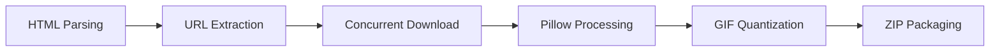

# 📦 Douyin-Emoji-Toolkit

> **底层逻辑**：通过自动化爬取与多线程转换，解决抖音 WebP 动态表情在微信等社交平台的兼容性痛点。项目源于对生活琐碎场景的深度洞察与技术赋能。

[](https://www.python.org/)
[](LICENSE)
[](https://github.com/Jacknie666/Douyin_emoji/stargazers)

---

## 🌟 项目核心价值 (Core Value)

本工具不仅仅是一个脚本，它是对 **“技术赋能生活”** 的一次微小实践。通过颗粒度细化的转换流程，将抖音封闭生态下的表情包资源，转化为开放生态（GIF）下的社交资产。

### 🚀 核心抓手 (Key Features)
*   **多维提取**：支持从 HTML 片段中精准识别 `WebP/PNG/JPG` 等多格式静态/动态链接。
*   **并发收割**：采用 Python `concurrent.futures` 实现高效批量下载，ROI 极高。
*   **跨端转换**：基于 `Pillow` 的深度转换逻辑，确保 WebP 动图完美降级为 GIF，解决微信兼容性“卡脖子”问题。
*   **极致优化**：支持颜色量化、抖动处理及帧率自适应，实现画质与体积的完美平衡。

---

## 🛠 技术架构 (Architecture)



---

## 📖 使用指南 (Usage)

### 1. 资源对齐 (Preparation)
在抖音网页版表情区域，通过开发者工具执行 `Copy outerHTML` 获取原始内容。

### 2. 环境初始化 (Setup)
```bash
pip install requests pillow beautifulsoup4
```

### 3. 进入 Sprint (Run)
```bash
python main.py
```

---

## 📂 项目演进 (Roadmap)
- [x] WebP 转 GIF 核心逻辑
- [x] 多线程并发优化
- [x] ZIP 自动化打包
- [ ] GUI 图形化界面 (规划中)
- [ ] 自动识别浏览器剪贴板内容 (规划中)

---

## ❤️ 情感基座 (Personal Note)
**致我最爱的宝宝**：没有你对可爱表情的执着追求，就没有这个项目的**底层驱动力**。每一次技术迭代，都是为了让你在使用表情包时能有更流畅的体验。

---

## 🤝 贡献与反馈
如果你发现了 Bug 或有更好的**打法建议**，欢迎提 Issue 或 Pull Request。

*Created with ❤️ by Jacknie666*
