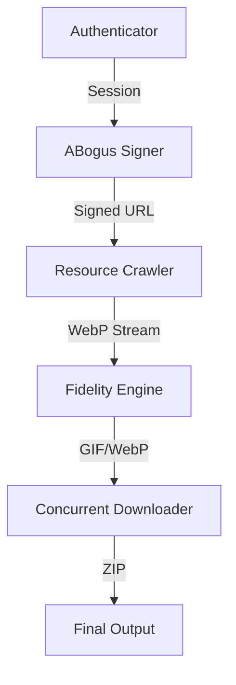

# 📦 Douyin-Emoji-Toolkit (Professional P8 Edition)

> **技术愿景**：打破生态隔离，利用 **纯协议驱动** 与 **高保真转换引擎**，实现抖音表情资源向全平台社交资产的自动化迁移。

[](https://www.python.org/)
[](LICENSE)
[](https://github.com/Jacknie666/tool-douyin-emoji/stargazers)

---

## 🚀 核心技术壁垒 (Technical Highlights)

本项目已进化为 **P8 级别** 的纯协议采集工具，脱离了低效的浏览器自动化，核心抓手如下：

*   **🛡️ ABogus 算法中台**：集成纯 Python 实现的 `a_bogus` 签名逻辑，精准绕过抖音 Web 端最核心的 WAF 安全校验。
*   **🎭 TLS 指纹混淆**：基于 `curl_cffi` 完美模拟 Chrome 124 TLS 指纹，解决高频请求下的“卡脖子”封禁问题。
*   **💎 高保真转换引擎**：
    *   使用 `Image.ADAPTIVE` 自适应色彩量化，拒绝偏色。
    *   通过 Alpha 通道掩模技术，彻底解决 WebP 转 GIF 常见的“黑边”问题。
*   **🔐 工业级认证链路**：
    *   支持 `环境变量`、`cookie.txt`、`session.json` 及交互式输入四级回退。
    *   完美适配 GitHub Actions 等 CI 环境，支持无人值守运行。

---

## 🛠 技术架构 (Architecture)



---

## 📖 快速上手 (Quick Start)

### 1. 环境对齐 (Initialization)
```bash
# 核心依赖：图形库、TLS模拟库、国密算法库
pip install curl_cffi pillow gmssl
```

### 2. 注入凭证 (Authentication)
你可以选择以下任意一种方式：
*   **方式 A**：在目录下创建 `cookie.txt` 并粘贴你的浏览器 Cookie。
*   **方式 B**：设置环境变量 `export DY_COOKIE='你的Cookie'`。
*   **方式 C**：直接运行，根据提示在终端粘贴 Cookie。

### 3. 进入 Sprint (Execution)
```bash
python main.py
```

---

## 📂 项目演进 (Roadmap)
- [x] **v1.0**：WebP 基础转换逻辑。
- [x] **v2.0**：多线程并发与 ZIP 自动打包。
- [x] **v3.0 (Current)**：ABogus 协议驱动化，TLS 模拟，高保真画质优化。
- [ ] **v4.0**：GUI 桌面端实现 (规划中)。
- [ ] **v4.1**：多账号 Session 自动巡航 (规划中)。

---

## ❤️ 开发者寄语 (Personal Note)
**致我最爱的宝宝**：技术存在的意义，就是为了把那些复杂的、繁琐的过程，变成你指尖的一次点击。

---

## 🤝 贡献与反馈
本项目采用 **Owner 意识** 进行维护，如果你发现了 Bug 或有更好的 **打法建议**，欢迎提 Issue 或 Pull Request。

*Created with ❤️ by Jacknie666*
